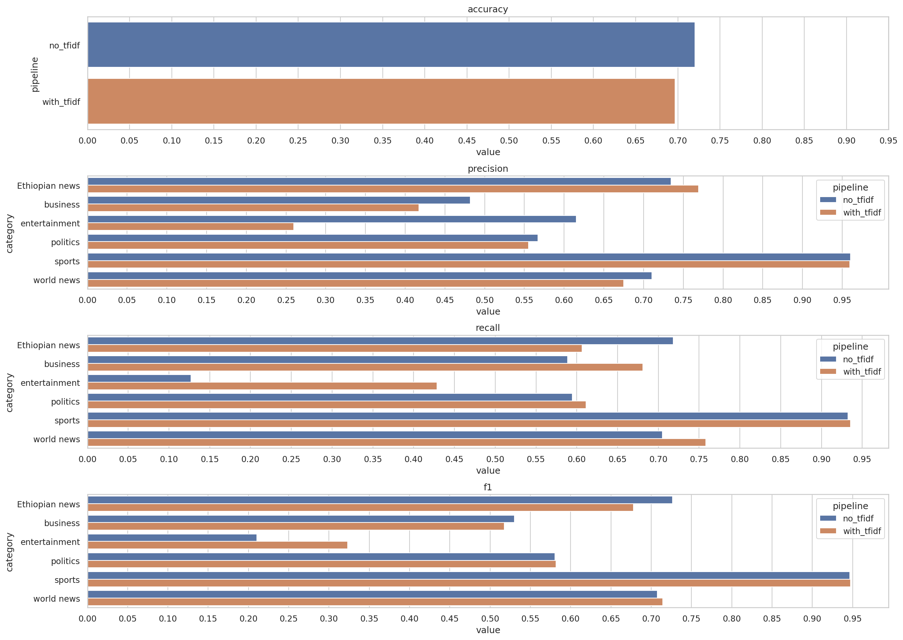

# `amharic-text-classifier`

This is a Jupyter notebook applying a [multinomial naïve Bayes classifier](https://en.wikipedia.org/wiki/Naive_Bayes_classifier#Multinomial_naive_Bayes) to news headlines in Amharic (for which the [Amharic News Text Classification Dataset](https://github.com/IsraelAbebe/An-Amharic-News-Text-classification-Dataset) was used).

Completed in 2022 as a personal project (as a master's student of theoretical and applied linguistics at Moscow State University at that moment).

### Output examples

```
--- pipeline: no_tfidf ---

text: የኢትዮጵያ መንግሥት "ሰላም ለማምጣት እየሠራሁ ነው" አለ
en:   Ethiopian government: "We are working to bring peace"
predicted class:
      Ethiopian news
class probabilities:
      Ethiopian news:  98.77%
      business:         0.00%
      entertainment:    0.00%
      politics:         0.15%
      sports:           0.00%
      world news:       1.08%

--------------------------------------------------

text: የሶማሊያው ሐሰን ሼኽ ሞሃሙድ ቃለ መሃላ ፈፀሙ
en:   Somalia's Hassan Sheikh Mohamud swears in

predicted class:
      world news
class probabilities:
      Ethiopian news:   0.00%
      business:         0.02%
      entertainment:    0.21%
      politics:         1.85%
      sports:           0.00%
      world news:      97.92%

--------------------------------------------------

text: ፌስቡክ የጥላቻ ንግግሮችን የያዙ ማስታወቂያዎችን ይለይ እንደሆነ በቀረበለት ፈተ...
en:   Facebook fails again to detect hate speech in ads

predicted class:
      world news
class probabilities:
      Ethiopian news:   2.80%
      business:         4.02%
      entertainment:    1.00%
      politics:         8.84%
      sports:           0.00%
      world news:      83.33%

--------------------------------------------------

text: ኢትዮጵያ በአፍሪካ ዋንጫ የማጣርያ ጨዋታ ግብፅን 2 - 0 አሸነፈች
en:   Ethiopia defeats Egypt 2-0 in Africa Cup of Nations qualifiers

predicted class:
      sports
class probabilities:
      Ethiopian news:   0.00%
      business:         0.00%
      entertainment:    0.00%
      politics:         0.00%
      sports:         100.00%
      world news:       0.00%

```

### Performance on the test set


